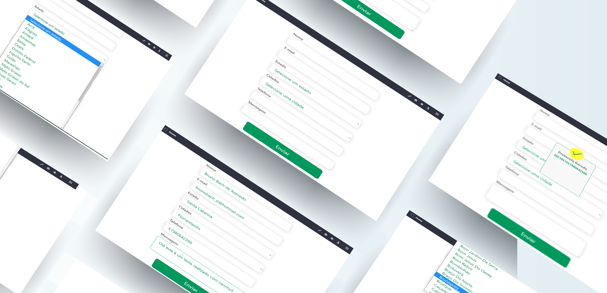

<h1 align="center">
    
</h1>

<h2 align="center"> 
	Unimed Full-stack Desafio
</h2>

<p align="center">	
  
	
  <a href="https://www.linkedin.com/in/bruno-bach/">
    
  </a>
  
  <a href="https://github.com/brunobach/unimed/commits/master">
    
  </a>

  
   <a href="https://github.com/brunobach/unimed/stargazers">
    
  </a>
</p>


> 1: Uma das exigências foi: “O banco de dados utilizado deverá ser o Oracle.” Iniciei o desenvolvimento com este banco através deste [Guia](https://blogs.oracle.com/oraclemagazine/deliver-oracle-database-18c-express-edition-in-containers). Porém, depois de alguns dias, o ambiente não subiu de forma alguma! Procurei soluções através de issues no git e stackoverflow, fóruns etc., mas atrasei o desenvolvimento e resolvi, utilizar o Postgres para agilizar e não retardar a entrega.

> 2: Criei um widget através do React, e fiz a integração com o Portal Liferay. Pode ser que não seja este o ponto do desafio, mas foi a maneira que encontrei de realizar essa integração.

## Funcionalidades

| Ambiente | Descriçao | Tecnologias |
|:---:|---------|:-----------:|
| Backend |API Rest com endpoints para listar estados/cidades e salvar o protocolo|  |
| Widget | Widget desenvolvido em React, com integração com a api feita em axios e gerado o portlet-widget atraves do Yeoman |     

https://nodejs.org/en/

## Passos para inciar
Por favor clone o projeto através do [Git](https://git-scm.com), e com [Docker](https://www.docker.com/), [NodeJS](https://nodejs.org/en/), e liferay portal instalados no ambiente.

Através de linha de comando:

### Instalar a API e executar

```bash
# Clone o repositorio
$ git clone https://github.com/brunobach/unimed

# Entre na pasta
$ cd unimed/backend

# Instalar o banco e executar a api
$ docker-compose up

# Após instalado e executado o servidor estará na porta http://localhost:8089/api/

# ROTAS da API
# GET http://localhost:8089/api/estados - Lista todos os estados

# GET http://localhost:8089/api/cidades/:id Lista todos os estados daquela UF. Sendo :id o id referente do estado na API de estados.

# POST http://localhost:8089/api/formulario Envia o formulario do widget, com os dados do requerinte retornando o protocolo.
```

> Nota 📎: Lembrando que a api pode ser executada através de outras maneiras não apenas por docker. Mudanças podem ser feitas para adequar ao ambiente ao qual vai ser executado. 

### Criar o widget-portlet

```bash

# Entre na pasta
$ cd unimed/portlet


# Mude o arquivo .npmbuildrc para a pasta de destino do liferay na maquina

{
	"liferayDir": "C:\\Liferay\\liferay-dxp-7.2.1"
}

# Executar o comando para instalar as dependências 
$ yarn 

#Ou
$ npm install

# Depois execute o comando
$ yarn deploy:liferay

# Após instalado o widget estará disponivel para utilizar dentro do portal do liferay, podendo ser integrado a qualquer página
```

## Demostração do Projeto no Liferay Portal

<h1 align="center">
    
</h1>

## Fontes

- https://github.com/cslr1126/service-panels
- https://github.com/tmoreira2020/spring-boot-liferay-portlet
- https://github.com/kkaravitis/angular-spring-boot-portlets
- https://www.youtube.com/watch?v=s7Htx7LUweg
- https://www.youtube.com/watch?v=JboavhUQkEU
- https://www.youtube.com/watch?v=7QhrnoIsqww
- https://www.youtube.com/watch?v=ytfRophBheg
- E muito mas muito mesmo: https://web.liferay.com/pt/community/liferay-projects/liferay-faces/documentation

